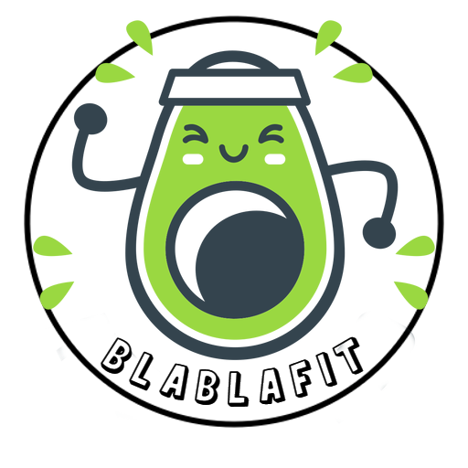

  <h1>👋 Hola, soy Albert</h1>
  
🚀 Desarrollador de Aplicaciones Multiplataforma y estudiante de Desarrollo de Aplicaciones Web 🌐

---

## 🛠️ Tecnologías y Herramientas

                
  <!-- Agrega el resto de tus tecnologías aquí -->

---

## 🚀 Proyectos Destacados

### BlaBlaFit - App DAM

  

- [Ver en GitHub](https://github.com/albertma09/BlaBlaFit)
- [Ver Demo](https://drive.google.com/file/d/1Yl-C2eU9Y6UuW9eLVsnpPxtufkVUYq5d/view?usp=sharing)
- [Memoria del Proyecto](https://drive.google.com/file/d/1UjYp2ANvZdSgJC9wWZXBn5-yhWh3e09l/view?usp=sharing)

### ERP DAM - Knight Vision

  

- [Ver en GitHub](https://github.com/albertma09/Knight-Vision)

### Creador de Presentaciones DAW - IAIA SLIDES

  

- [Ver en GitHub](https://github.com/albertma09/IAIA-Slides)

---

## 📬 Contáctame

- LinkedIn: [Albert LinkedIn](https://www.linkedin.com/jobs/collections/recommended/?currentJobId=3638734543)
- Correo Electrónico: [albertmateos09@email.com](mailto:albertmateos09@email.com)
